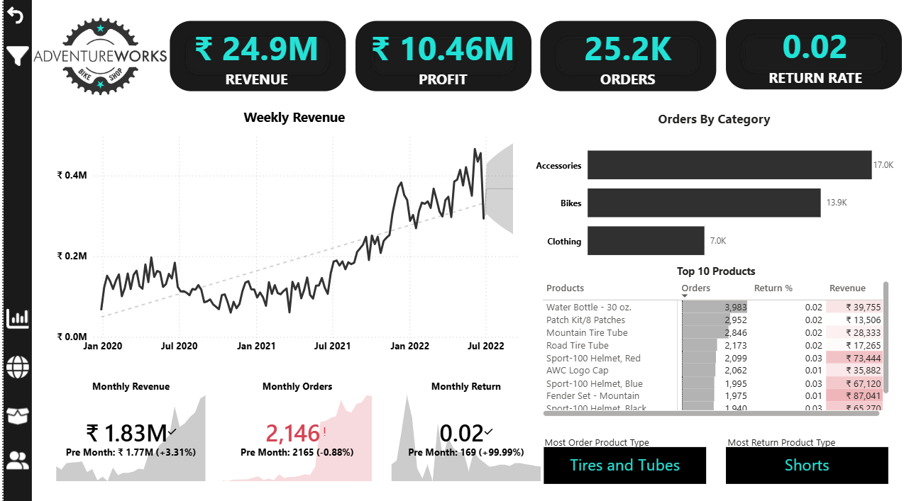
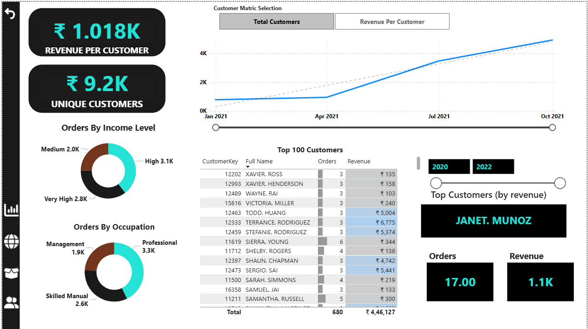
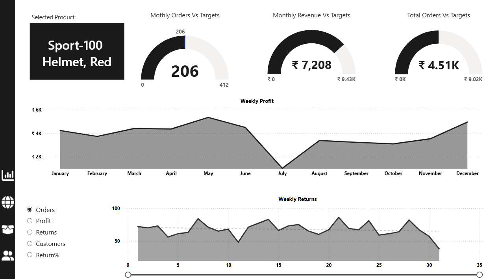
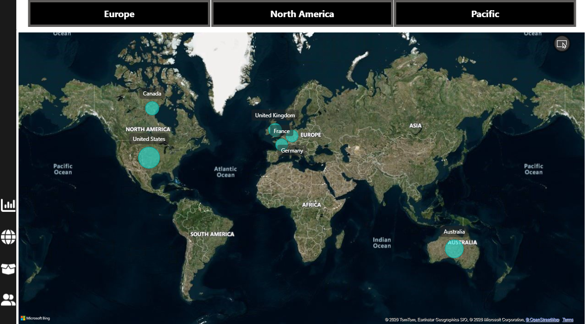

# AdventureWorks Sales Analytics Dashboard

## Project Overview
This project is an interactive Power BI dashboard developed using the AdventureWorks dataset. The dashboard provides insights into sales performance, customer behavior, product performance, and regional analysis through dynamic and interactive visualizations.

---

## Business Objectives
- Analyze overall sales and profit performance
- Monitor customer purchasing behavior
- Identify top-performing products
- Track return rates and order trends
- Compare regional sales performance

---

## Tools & Technologies Used
- Power BI
- Power Query
- DAX
- Data Modeling
- Data Visualization

---

## Dashboard Features
- Interactive KPI Cards
- Dynamic Filtering & Slicers
- Customer Segmentation Analysis
- Product Performance Tracking
- Regional Sales Mapping
- Revenue & Profit Trend Analysis
- Forecasting Visuals
- Drill-through Navigation

---

## Key Metrics
- Revenue: ₹24.9M
- Profit: ₹10.46M
- Orders: 25.2K
- Return Rate: 0.02

---

# Dashboard Screenshots

## Executive Dashboard

---

## Customer Insights Dashboard

---

## Product Performance Dashboard

---

## Regional Analysis Dashboard

---

## Learning Outcome
This project helped strengthen my skills in:
- Data Cleaning
- Data Modeling
- DAX Calculations
- Dashboard Storytelling
- Business Intelligence Reporting

---

## Dataset
AdventureWorks Sample Dataset

---

## Author
Anas
